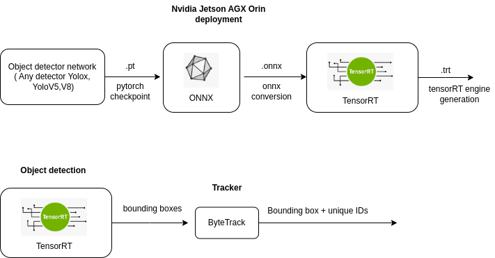

# crop_tracker

Detection and tracking of crops and weeds using Yolox + ByteTrack

* Detection: Object detection operates on individual frames independently. It identifies and locates objects in each frame, but it doesn't maintain any information about how these detections relate to each other across different frames. Each frame is processed in isolation.
* Tracking: Tracking assigns a unique identifier (ID) to each detected object and maintains this ID across multiple frames. This allows the system to recognize that the "Crop" detected in frame 1, frame 2, and frame 3 is actually the same crop across frames.

The project is done at [agricultural robotics](https://agrobotics.uni-bonn.de/index.html) in University of Bonn. The code in this repo is not part of the original repo instead it is just a prototype.

The actual code, optimized in C++, is proprietary to the agricultural robotics lab and is not shared here.

